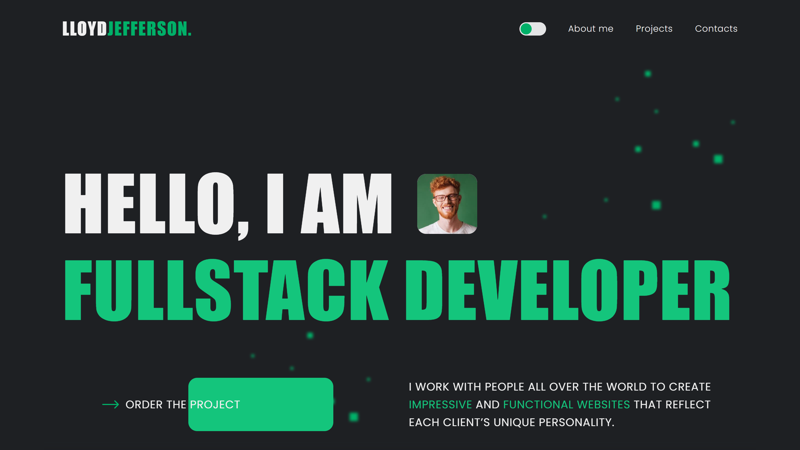

# Portfolio (Team Project)

Portfolio is a responsive team-built portfolio website with a modern adaptive layout and a dark/light theme. The theme automatically follows the user’s OS preference, and manual theme selection is persisted in the browser for future visits.

## Live Website
- https://valentyn-m.github.io/project-group-15_Portfolio/

## Key Features
- Responsive layout for mobile/tablet/desktop
- Dark/light theme with OS preference detection
- Manual theme toggle with persisted user choice
- Smooth navigation across page sections (typical portfolio structure)
- Interactive UI components (accordions/sections, sliders, etc.)
- REST integration via Axios (HTTP POST)

## Technologies Used
- HTML5
- SCSS
- JavaScript
- Swiper
- iziToast
- accordion-js
- Vite
- Axios
- REST API (HTTP POST)
